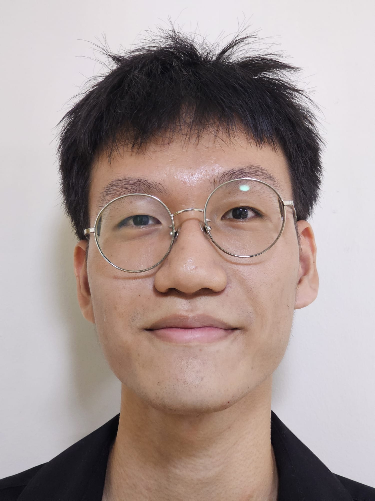
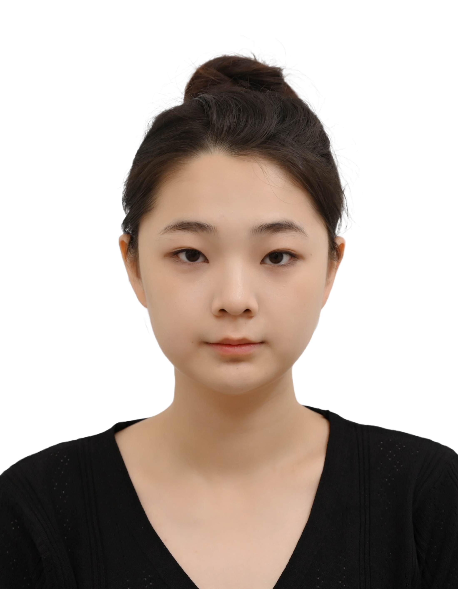
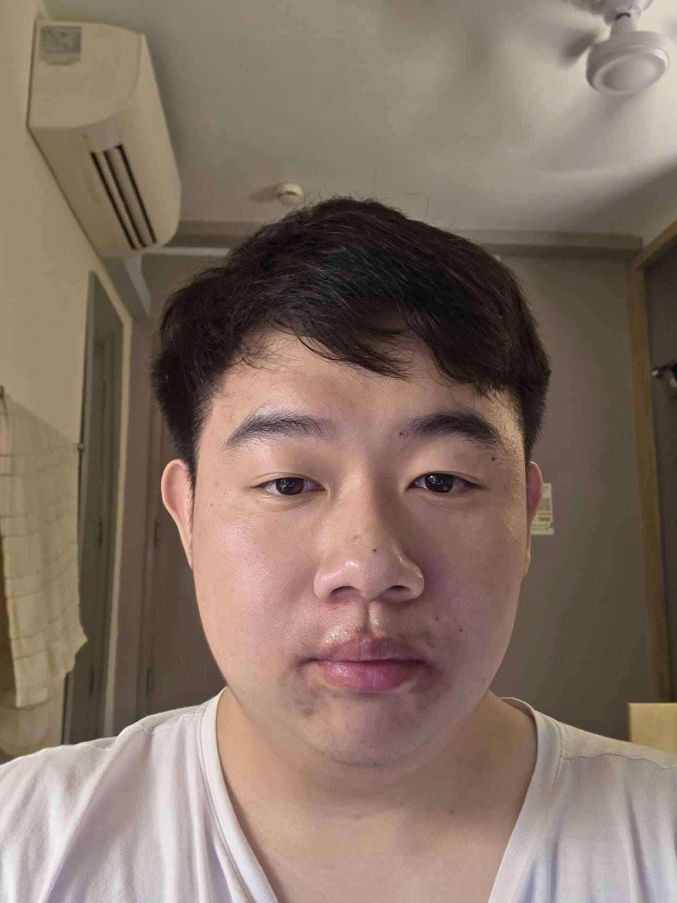
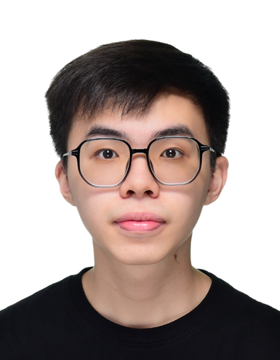

# About Us

We are a team based in the [School of Computing, National University of Singapore](http://www.comp.nus.edu.sg).

You can reach us at the email `seer[at]comp.nus.edu.sg`

## Project team

### Seah Jia Le

[[github](https://github.com/seahjiale)]

* Role: Developer
* Responsibilities : Scheduling and tracking 

### Lu Ziyue

[[github](https://github.com/luziyue525)]

* Role: Developer
* Responsibilities: Testing

### Yang Jie Loh

[[github](https://github.com/yangjieloh)]

* Role: Developer
* Responsibilities: Documentation

### Loh Yang Zhi

[[github](https://github.com/yangzhiloh)]

* Role: Developer
* Responsibilities: Integration

### Jeff Lim

[[github](http://github.com/lim-04)]

* Role: Developer
* Responsibilities: Code Quality
